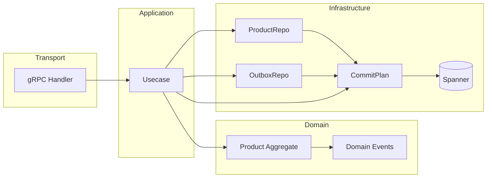

# Product Catalog Service

A simplified Product Catalog Service that manages products and their pricing using domain-driven design and clean architecture. It provides gRPC APIs for product lifecycle, pricing rules (percentage-based discounts), and queries over Google Cloud Spanner.

## Running the service

### Prerequisites

- Go 1.21+
- Docker and Docker Compose (for the Spanner emulator)

### Start Spanner emulator

```bash
docker-compose up -d
```

Or use the Makefile:

```bash
make docker-up
```

Set the emulator host so the client connects to the local emulator:

```bash
export SPANNER_EMULATOR_HOST=localhost:9010
```

### Run migrations

Create the Spanner schema (tables and indexes). Run with the emulator host set:

```bash
make migrate
```

### Run tests

```bash
make test
```

E2E tests require the emulator to be running and `SPANNER_EMULATOR_HOST=localhost:9010`; they are skipped if the env is not set.

### Start the gRPC server

With the emulator running and migrations applied:

```bash
make run
```

The server listens on port 8080 by default. Override with `GRPC_PORT`. Spanner config uses env vars `SPANNER_PROJECT`, `SPANNER_INSTANCE`, `SPANNER_DATABASE` (defaults: `test-project`, `test-instance`, `product-catalog`).

### Quick reference

```bash
# Start Spanner emulator
docker-compose up -d

# Run migrations
make migrate

# Run tests
make test

# Start server
make run
```

## Design decisions and trade-offs

- **Domain purity:** The domain layer is pure Go: no `context`, no Spanner or other infra, no protobuf. All money is represented with `*big.Rat` for precise decimal arithmetic. Business rules live in the Product aggregate and value objects (Money, Discount).

- **Golden Mutation pattern:** Every write flows as: create/load aggregate → call domain methods → build a CommitPlan of mutations (product + outbox) → apply the plan in a single Spanner transaction. Repositories only return mutations; usecases apply the plan. Handlers never touch transactions.

- **CQRS:** Commands go through usecases and domain; queries use a read model and DTOs. List products reads directly from Spanner with filters (active only, optional category) and pagination; GetProduct returns any product by ID (including inactive and archived) with effective price computed via the domain pricing service.

- **Transactional outbox:** Domain events are captured as intents; usecases enrich and persist them in an `outbox_events` table in the same transaction as the product write. No background outbox processor or Pub/Sub publishing is implemented—events are stored only.

- **Archive:** Archive (soft delete) is implemented in the domain and in an archive_product usecase. It is exposed via gRPC as ArchiveProduct so clients can soft-delete products; ListProducts returns only active products.

- **Concurrency:** Optimistic locking is implemented via a `version` column on `products` and conditional DML in the same transaction (update is applied only when `WHERE product_id = ? AND version = ?` matches one row; otherwise the transaction fails with a conflict error). E2E tests include a concurrent-update scenario that verifies one of two concurrent updates fails with the expected error.

## Architecture (high level)



## Project structure

- `cmd/server` – gRPC server entrypoint; `cmd/migrate` – schema migration against Spanner.
- `internal/app/product` – domain, usecases (commands), queries, contracts, repo (Spanner + outbox).
- `internal/commitplan` – in-process plan of mutations; Spanner driver runs them in one ReadWriteTransaction.
- `internal/transport/grpc/product` – gRPC handlers and proto mapping.
- `internal/models` – DB row types for products and outbox.
- `proto/product/v1` – gRPC API definition.
- `migrations` – Spanner DDL.
- `tests/e2e` – end-to-end tests against the emulator (usecases and queries, no gRPC client).
